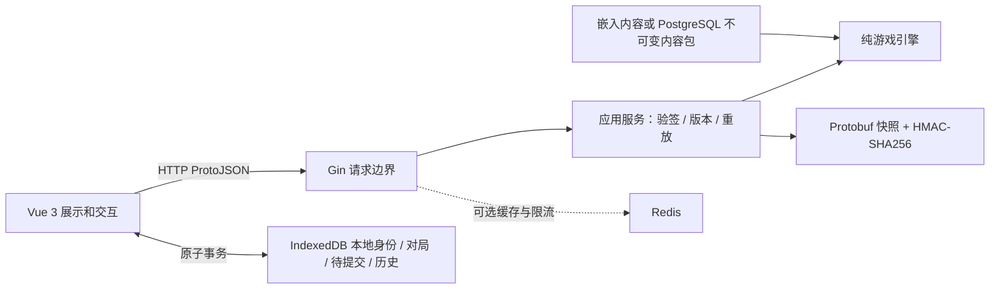
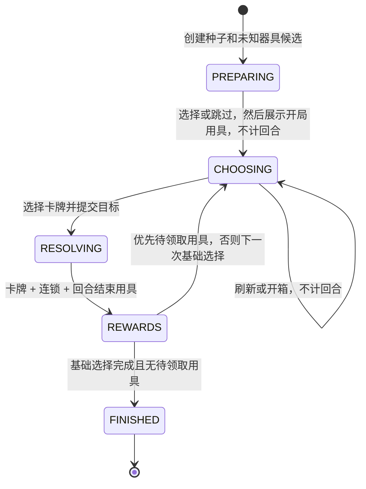

# 渴瘾模拟器：实现架构

当前规则／内容版本为 `rules-v1` / `cards-v1`，即首次公开的不可变数据快照；流程为独立开局用具、七次药剂与三次方案。内容目录覆盖并启用全部 24 项手术用具、37 项药剂（含四种药剂箱）。不支持的历史版本不会静默迁移。

## 1. 分层与依赖

`engine.Apply(state, command, rules)` 对输入克隆后结算，返回完整新状态及有序事件。任何错误都放弃克隆；不会消耗原存档中的随机数、刷新次数或回合。引擎依赖生成的协议类型和 Go 标准库，不依赖 Gin、数据库或 Redis。

首版用一个内容包模型承载规则与卡牌，无额外微服务或通用脚本语言。基础效果由 `EffectSpec` 组合，复杂效果通过明确的 Go 处理器实现；中文描述只用于显示，不参与执行。

## 2. 状态与流程

`GameState` 将以下状态分开保存：

- `base_cursor`：11 次基础选择的位置，0 为开局用具，1–7 为七次药剂，8–10 为最后三次方案。
- `completed_turns`：正式回合数，包含 0–2 个分数奖励用具回合。
- 六个固定、有序槽位及怪物实例；与奖励罐完全独立。
- 当前候选与候选 ID、拥有用具的获得顺序、两种整局刷新额度。
- `opening_tool_family`：初始怪物组数最多的流派；并列时使用初始化随机流选定一次，随签名存档保存。
- 当前分数与峰值；可回退奖励罐和掉落加成；两个用具门槛的 `LOCKED/PENDING/CLAIMED` 状态。
- 对局格式、规则、内容和随机算法版本；三个随机流状态与实例编号。

`RESOLVING/REWARDS` 是一次请求内的执行步骤，不向浏览器暴露可继续修改的中间存档。最后一个方案回合也可解锁用具；清空奖励队列后才结束。两个门槛同回合解锁时先领取 8000，再领取 28000。

开局用具的 `reward_threshold=0`，消耗一个基础流程位置；分数用具的门槛为 8000/28000，不推进基础流程。刷新保留门槛来源，不能把开局用具误当作分数奖励。未解锁的分数奖励不补发，因此正式回合最多十三次。用具全局不重复；药剂允许重复。

开局及开局刷新仅使用 11 件核心用具，`CardDefinition.core_family` 保存所属流派：骨卫兵 3、异魔 3、觉醒者 2、蛊虫 3。每个候选从尚未抽出的核心中产生，开局流派组共享 55%，其余组共享 45%，各组内等概率；某组为空时从剩余组等概率抽取。首抽流派取场上怪物数最多的流派，多个流派并列时优先觉醒者，其余平局等概率随机。8000/28000 分奖励及其刷新使用全部未拥有用具，不使用流派权重。`tool_offers.go` 负责流派判定与整数权重。

界面使用三列：左侧纵向显示回合、当前分数、下一档门槛、奖励罐；中间为缩短高度的六个培养槽以及统一选牌区；右侧仅放已有用具和日志。未知器具、开局用具、分数奖励用具、药剂和方案全部由中间同一个 `ChoicePanel` 渲染，不随卡牌类别切换列。

每次卡牌操作逐步执行，其直接触发的事件链处理完再执行下一步。用具按获得顺序执行，条件读取执行当时的场面。新获得用具参与本回合结束。正式回合数在回合结束触发前加一，用于周期效果。

融合和吞噬内部直接变更槽位，只发 `fused/devoured`，不发 `removed/added`。事件携带序号、父序号、来源、目标和属性变化，界面可解释连锁。每命令最多 512 个效果/事件执行步骤，超限整次回滚。

## 3. 属性、评分与演示细节

基础属性：普通 `1×36`，魔法 `5×24`，稀有 `15×12`，首领 `300×1`。变异/觉醒保留现值，再叠加最终目标稀有度的基础值；跨两阶只加最终目标基础值一次。按阶数觉醒的首领不再升级；指定稀有度的觉醒允许降阶和同阶。至纯圣水对原首领觉醒者直接增加 `300×1` 对应的活性／数量。融合分别求和，不另加生成怪物基础值；吞噬保留吞噬者身份。

`score = Σ(activity × quantity)` 使用有溢出检查的 int64。只在完整回合结算后解锁用具；中间短暂达到门槛无效。奖励罐、15% 加成从当前分数重算；峰值仅用于历史展示。已解锁/已领取用具状态不随降分回退。

所有说明书阈值已实现：2000/18000 各增三白罐；8000/28000 各一个用具；38000/57000/76000/114000/152000/190000 依次转紫；266000/342000/418000/512000/607000/721000 依次转红；854000 获得 15% 掉落加成；1120000 一罐转彩。

**演示边界与固定默认值：**

- 随机生成种群等概率；未显式指定稀有度时按 45/30/20/5 权重抽取（普通/魔法/稀有/首领），初始、添加、变异三条路径共用同一权重。添加优先最左空槽，满槽只发溢出事件。数值并列选择左侧。
- 普通药剂每个候选独立按 40/35/20/5 抽稀有度，再从该等级可选卡牌中抽取。为保持准确权重，样例池允许同一候选组出现同名药剂。用具候选无重复并排除已有用具。
- 对当前场面没有合法目标的药剂不进入本次抽取池。目标选择由后端枚举合法有序组合，最多六个槽位；前端只匹配这些组合并提交。
- 混合稀有度融合按最高源稀有度升一阶，上限首领，放在最左源槽位。
- 添加的显式初始增益先应用，再触发添加事件。普通变异即使随机到相同分类也执行一次变异并叠加基础值。
- 蒸骨坩埚演示为两组骨卫兵加一组非骨卫兵；同名怪物在此阶段只有种群与稀有度定义，不实现具体怪物变体。
- 疫区圣母像每次触发冻结各稀有度候选池，避免同一怪物连续跨池被再次觉醒。二度降生者之嘴按 `活性×数量` 选择最低总活性目标，并排除吞噬者。
- 药剂定义与处理器位于 `potions.go`，用具定义与处理器位于 `tools.go`。禁用条目不会进入候选，提交禁用条目的命令也会被拒绝。
- `boxes.go` 负责药剂稀有度抽取和开箱。普通候选与普通箱均使用 40/35/20/5 概率，稀有箱使用 30/20/40/10；普通候选最多一个箱子，箱内候选排除全部箱子。打开小／大箱生成 3／5 支随机药剂，不推进回合或消耗刷新次数。
- 测试用吞噬卡与固定候选箱不在运行时卡池；吞噬基础机制由直接调用测试覆盖。

## 4. 接口与存档契约

详细字段以 `api/game.proto` 为唯一契约。HTTP 使用 ProtoJSON，大整数以十进制字符串传输，前端不把分数转成 JS Number。

| 接口 | 请求重点 | 返回 |
|---|---|---|
| `POST /api/v1/runs` | userId、requestId、petRefreshes、可选 seed 与版本 | 签名快照、展示、游戏状态摘要 |
| `POST /api/v1/runs/:id/commands` | stateToken、requestId、expectedRevision、command | 新快照、展示、事件和摘要 |
| `POST /api/v1/runs/:id/restore` | stateToken | 验签后的展示 |
| `POST /api/v1/replays/verify` | 种子、所有版本、宠物配置、命令序列、可选原摘要 | 重放状态、摘要、verified |

命令类型为 `choose`、`skip_unknown`、`refresh`；每条命令必须匹配当前 `offerId`。`choose` 使用 `cardId` 与有序 `targetIds`，提交与校验在一个后端调用中完成。

签名格式为 `keyId.base64url(protobuf).base64url(HMAC)`，签名覆盖版本标识及原始快照字节。快照不加密，不承诺隐藏种子或防止玩家分析未来随机结果。浏览器指纹不是认证机制，恢复旧存档与分支练习也不被禁止。首版没有排行榜和可信反作弊分数。

创建请求以浏览器随机 requestId、匿名 ID 和服务密钥派生默认种子及对局 ID，同一请求重试不新建不同局；显式种子优先。正常命令本身确定性重算，Redis 仅减少重复计算。

随机算法固定 SplitMix64；SHA-256 从种子与流名称派生初始化、抽取、效果三个独立流。采用拒绝采样避免取模偏差。保存随机状态，恢复不重抽候选。重放摘要排除 runId、userId、revision 等传输身份，其余完整状态必须一致。

## 5. 本地事务与故障语义

IndexedDB 数据库 `vorax-lab-v1`：`meta` 保存身份和当前局指针，`runs` 保存完整记录，`pending` 保存至多一个待提交操作。一次事务不跨越网络请求：

1. 对当前局与 revision 做本地比较，原子保存待提交请求。
2. 发送原样命令，后端验签和结算。
3. 在新的本地事务中再次比较当前局/revision 和请求 ID，写新存档及历史、清除 pending。

网络失败保留 pending，刷新页面后可用同一请求重试；保存失败保留旧快照和 pending，不假报保存成功。两标签页抢同一局时，只有一个能成功登记命令；旧结果不能覆盖新版本。BroadcastChannel 只提示其他标签页更新，正确性由 IndexedDB 事务保障。

匿名 ID 首次由浏览器特征摘要加随机本地盐生成，后续复用已有 ID，不上传原始指纹。记录不支持跨域、跨浏览器同步。浏览器存储被清理或浏览器配额回收时可能丢失历史；无法依靠匿名指纹从服务端找回数据。

部署时保留签名密钥与已支持内容版本，旧密钥可通过版本映射继续验签。不存在的规则版本返回 `VERSION_UNAVAILABLE`，缺失签名密钥版本返回 `KEY_UNAVAILABLE`，均不静默替换。

## 6. 测试映射

- `internal/engine/engine_test.go`：完整奖励阶梯升降、属性继承、独立事件、左右跨空槽、溢出、触发顺序、新用具当回合参与、收尾奖励插入、瞬时达标无效、刷新计数、周期触发、异常回滚、64 个种子的全流程保存恢复，以及怪物稀有度 45/30/20/5 精确权重边界。
- `internal/engine/catalog_test.go`：对照说明书核对完整目录、禁用条目拒绝、旧内容版本拒绝，以及另外 256 个种子的完整对局与逐条事件重放。
- `internal/engine/tools_test.go`、`internal/engine/potions_test.go`：用具与药剂效果、合法目标、边界条件、事件顺序、周期与溢出回滚。
- `internal/engine/tool_offers_test.go`：核心流派目录、55%/45% 精确权重、候选去重及分组耗尽、初始组数判定与随机并列、开局刷新与恢复、后续完整等概率池及失败回滚。
- `internal/engine/boxes_test.go`：四种箱定义、稀有度权重边界、单批最多一箱、箱内无箱、开箱计数、事件重放、陈旧请求及失败回滚。
- `internal/application/service_test.go`：创建与命令重试、服务重启恢复、签名篡改/局标识/版本拒绝、本地密钥持久化、旧密钥轮换、完整重放摘要。
- `internal/transport/http_test.go`：HTTP/ProtoJSON 大整数、恢复接口、未知字段、同源检查、请求大小。
- `tests/storage.test.mjs`：本地事务原子性、并发标签页、网络中断重试、写入失败回滚、历史与恢复。
- `internal/storage/integration_test.go`：可选真实 PostgreSQL 内容幂等写入，以及 Redis 缓存、限流与失败降级。

后续扩展卡牌时先固定内容版本、为新行为增加语义测试，再接入可抽取池；不能修改已发布版本的含义而保留同一版本号。
